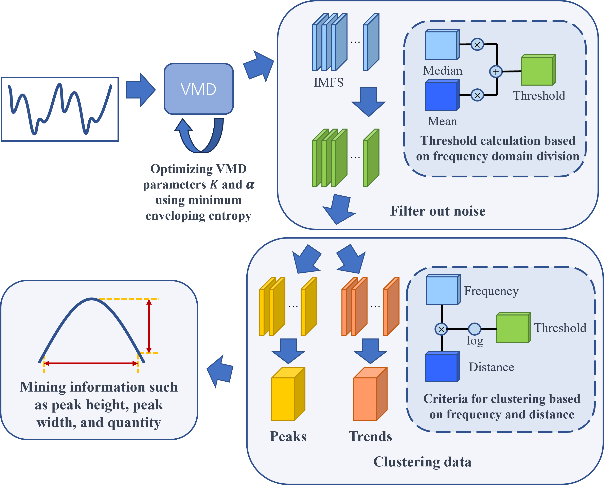

# GAO-VMD-SE

## Abstract

As the application of machine learning technology in predicting and optimizing material performance continues to grow, handling electromagnetic data of high-frequency magnetic materials, especially in removing unavoidable data noise and accurately extracting resonance peaks in the imaginary part of electromagnetic information, has become a significant challenge. These steps are crucial for revealing the deep electromagnetic behavior of materials and optimizing their performance. In response to this challenge, this study introduces an innovative approach—Genetic Algorithm Optimized Variational Mode Decomposition for Signal Enhancement (GAO-VMD-SE). This method, through the Variational Mode Decomposition (VMD) technique optimized by genetic algorithms, not only effectively reduces noise in the data, thereby improving the Signal-to-Noise Ratio (SNR) and reducing the Mean Absolute Error (MAE), but also significantly enhances the hidden resonance peak information in complex permittivity and permeability data, achieving a comprehensive improvement in key performance indicators. Experimental results prove that this method surpasses traditional analysis techniques in key performance metrics such as peak width ratio, peak overlap ratio, and the number of peaks. Especially in identifying characteristic peaks related to the Snoek limit, GAO-VMD-SE can effectively reveal peak features hidden in complex data, providing important insights for evaluating the performance of materials at specific frequencies. Moreover, the effectiveness of this method in denoising not only enhances the quality and accuracy of material data analysis but also achieves a 1\% to 10\% enhancement in peak information extraction. This optimized data processing capability and versatility make GAO-VMD-SE not only suitable for evaluating the performance of high-frequency magnetic materials but also show significant practical application value in processing spectral data and other time-series signal data applications.

## Approach

The framework begins by optimizing the key input parameters of Variational Mode Decomposition (VMD), including the number of modes $K$ and the penalty factor $\alpha$, through a genetic algorithm. The optimization aims to minimize the envelope entropy as the objective, enhancing the signal decomposition effect. Next, the algorithm performs VMD decomposition on the signal, obtaining multiple Intrinsic Mode Functions (IMFs). It then filters out noise IMFs using an adaptive threshold method, retaining valuable signal components. Subsequently, the remaining IMFs are meticulously clustered into two categories: those reflecting data trends and those describing data peak features, facilitating further analysis. The final stage focuses on extracting target peak information from the data peak class IMFs, accurately capturing key features in the data.